# Sware-Eng-Summ1

## Introduction

This repository holds code and files for the Software Engineering module summative 1 assessment. Primarily this is an assessment response, but it's also a real project with real business value potential. Broadly this work requires proposing a product, planning the project that will create it, designing the product (including a prototype), building a minimum viable product, using test driven development, adding features gradually, writing user and technical documentation, keeping documentation up to date through use of ticketing, branches and pull requests, and finally evaluating the latest version of the product.

## Product Proposal

All staff in my organisation must attend an office location for a proportion of their working time. Policy states minimum attendance is 60%, measured as a proportion of working days within each calendar month. Attendance is logged daily via any connection to the IT network from an office location. There are complicating factors, for example staff may have approved lower minimum attendance, all staff take annual leave and sick days which aren't counted as working days, and working days in each calendar month varies. It can be difficult to understand how many attendances are needed to meet a monthly target and effectively plan.

I propose an app for colleagues to manage personal attendance. The app should allow individuals to input data about attendance target, days of attendance and non-working days. It should provide output to tell the user what their current attendance is, and how many attendance days are required to meet their target for the month. 

The product should be a simple web app, available to everyone in the business, and should not require the use of any personal information.

## Design and Prototype

During the design phase I sought to make use of [design thinking]( https://www.interaction-design.org/literature/topics/design-thinking?srsltid=AfmBOooezt5y7TBG-tAJRxUIsMbFgmz2_q1PoQINIUW63QR0KgD8K3Su), which typically has five stages:
-	Empathise
-	Define
-	Ideate
-	Prototype
-	Test

### Empathise
To understand user needs I sought to gain empathetic insight into specific issues and needs of colleagues. In a team meeting and one to ones I asked a series of user research questions about existing behaviour, pain points, wants, diversity of requirements, specific feature requests and technical preferences. All responses were recorded on a whiteboard app.

  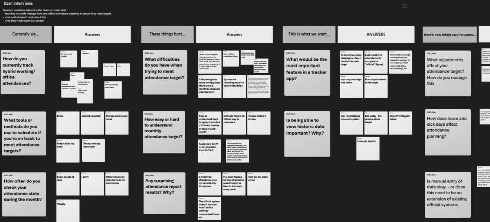

 
### Define
To define the problem clearly, I summarised responses in a generalised mind map, setting out the key things users say, think, do and feel. 

  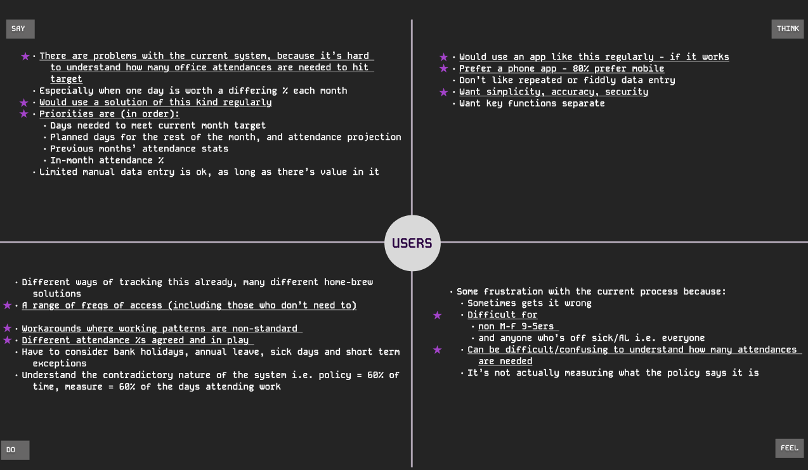

I identified three key user identities, who expressed differing ways of working, stressors and needs. 

  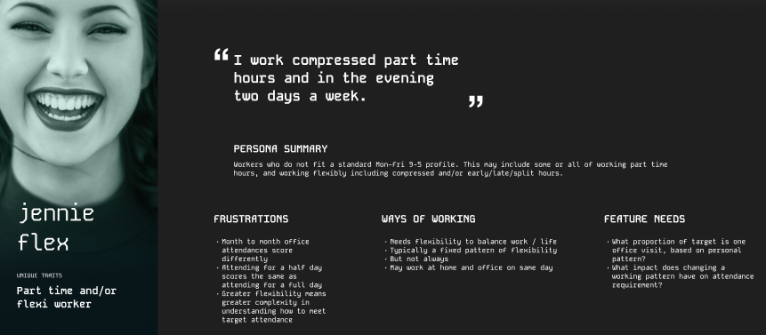

  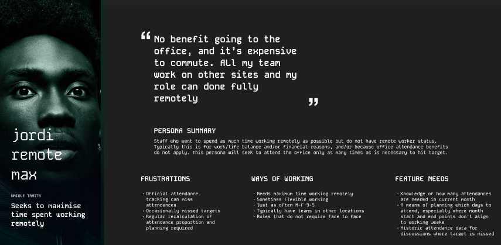

  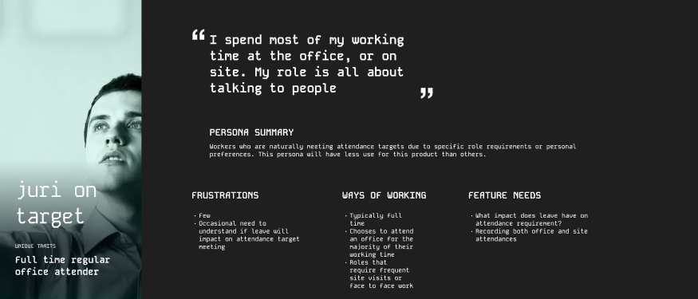

 
### Ideate
From this empathetic understanding I identified the key feature requirements and began to come up with ideas about how the solution might be developed by sketching out a couple of very simple diagrams.

  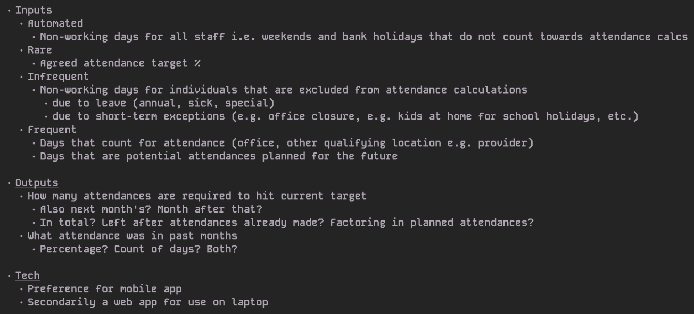

  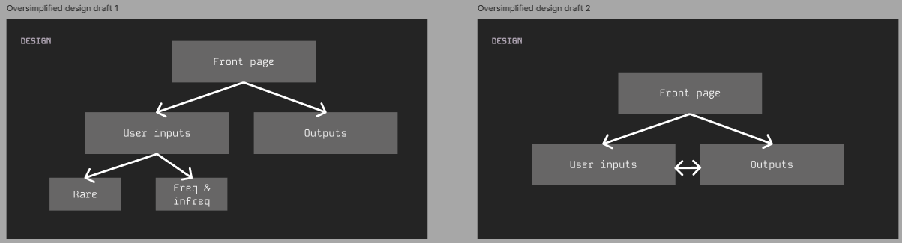

 

### Prototype
I created a [prototype app in Figma]( https://www.figma.com/design/uztRTxsJzu00kpS4OySQiY/Attendance-Planner?node-id=1-2&p=f&t=WnK5MaKJqCFH7HNM-0), first as a wireframe to set out the key navigational functionality and page layouts, then a full prototype including demonstration of all key functionality, and application of styling. 

  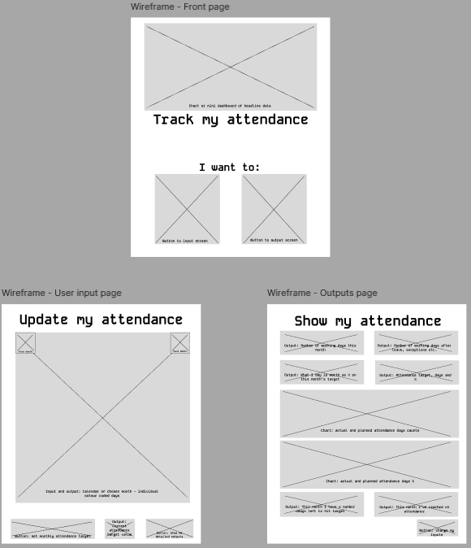

  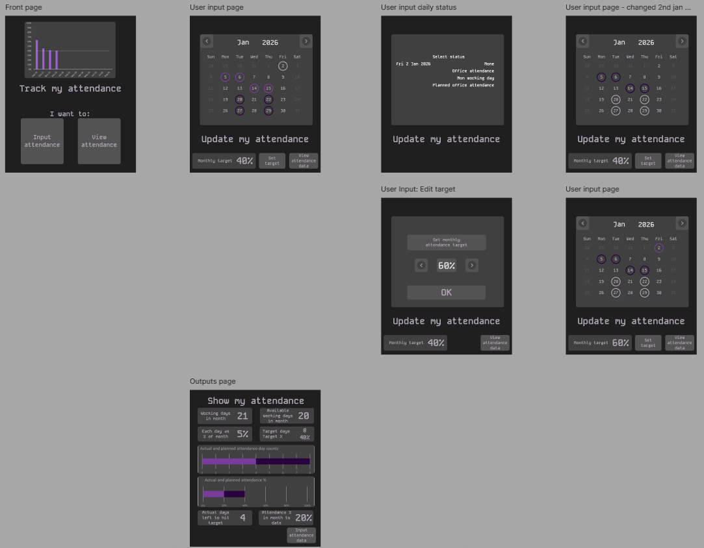

 

### Test
Finally, I asked users to provide feedback about the prototype and incorporated key points into a revised design.

## Plan

For the first step of planning, I created a [Github projects roadmap]( https://github.com/users/ElTigreNumero5/projects/4/views/4) setting out four key phases for this work and rough timescales for delivery.
1.	Planning
2.	Design and prototyping
3.	Development
4.	Write up
In the planning phase I undertook all issues associated with the preparation of this project, including deciding what project management framework to use and implementing that framework and the tools required to utilise it.

### Project management technique
I chose to use a lightweight version of [Scrum Agile](https://www.scrum.org/resources/what-scrum-module), taking some of the framework’s useful features such as [backlogs](https://scrumguides.org/scrum-guide.html#product-backlog) and [sprints](https://scrumguides.org/scrum-guide.html#the-sprint) to assist in managing delivery of user requirements.

### Sprint planning
To deliver post-planning phases, I planned sprints, setting out key issues and deliverables to be addressed in each. Typically, sprints are longer time-boxes, but for a compressed piece of work such as this, I opted for very short sprints.

  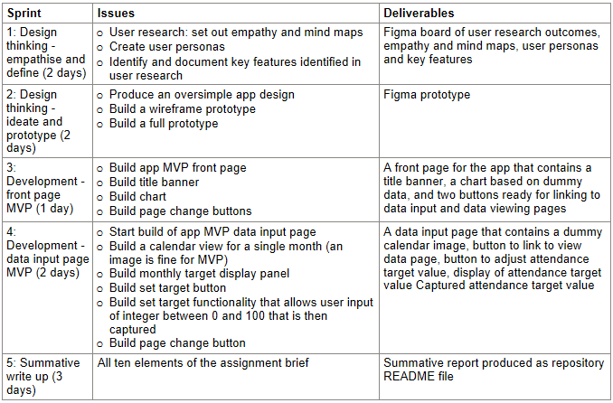

### Project management tool
I used Github projects to manage this work and created of a backlog of issues on a planning board. Each issue/ticket moves from column to column as it progresses. For example, the screenshot below shows the planner in its state as of 15th January 2026, with a backlog of issues that are still to be completed, some planned into the current sprint and ready to be picked up, several underway as part of this write up, none awaiting PR review and many already complete.

  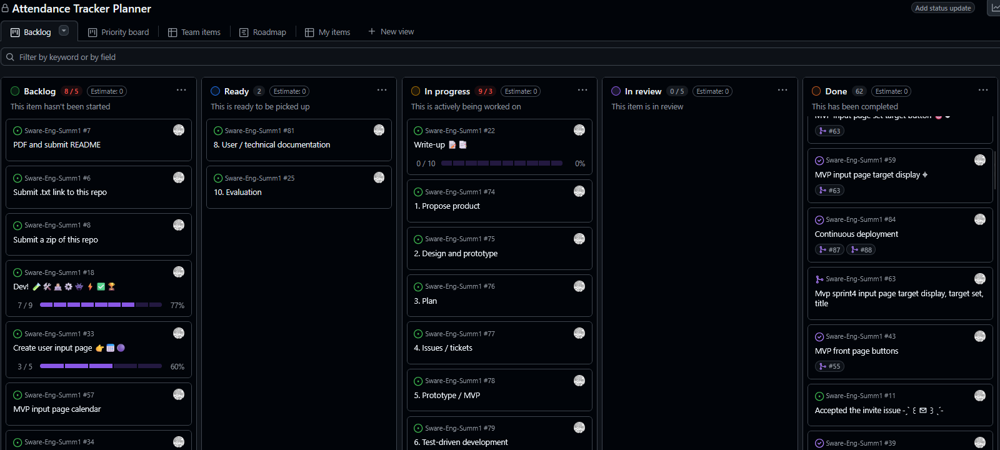

 

## Tickets

To ensure all user requirements were delivered, I recorded each as issues. Initially these were high-level issues such as those used in the roadmap. I then added sub-issues to define specific tasks, deliverables and definitions of done. For example, the [Dev issue]( https://github.com/ElTigreNumero5/Sware-Eng-Summ1/issues/18) was broken down into nine sub-issues. Some sub-issues themselves required further refinement, for example, the [Create app front page](https://github.com/ElTigreNumero5/Sware-Eng-Summ1/issues/31) ticket is broken down into six further sub-issues required for that page, to cover the specific user requirements and app functionality. Issues are all available within the planner board.

  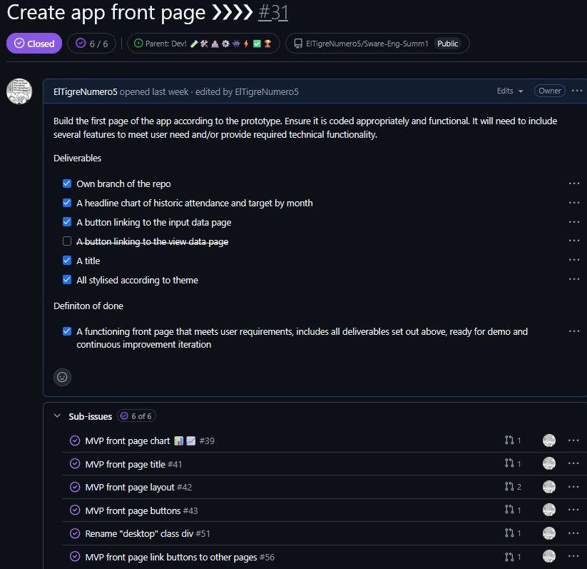

Good ticket writing is important to capture and convey the right quantity and quality of information. All should include a descriptive title and a [detailed description](https://dev.to/usooldatascience/writing-great-github-issues-for-open-source-projects-a-newbies-guide-2c4d) of what the objective of the issue is such that anyone can understand the issue clearly. [Deliverables](https://www.tilburgsciencehub.com/topics/automation/version-control/start-git/write-good-issues/#provide-deliverables) (or acceptance criteria) should be included to provide explicit understanding of what needs to be provided to address the issue. Further, a definition of done provides a statement to determine whether an issue is ready to be closed. Different projects may use different styles of definitions of done for example [this definition](https://bdavison.napier.ac.uk/agile/github/dod/) includes all acceptance criteria plus a range of additional components. Labels allow useful categorisation and filtering of tickets, assignment tells collaborators who is working on an issue, projects show which project a ticket relates to, and relationships show parent or child issues. 

  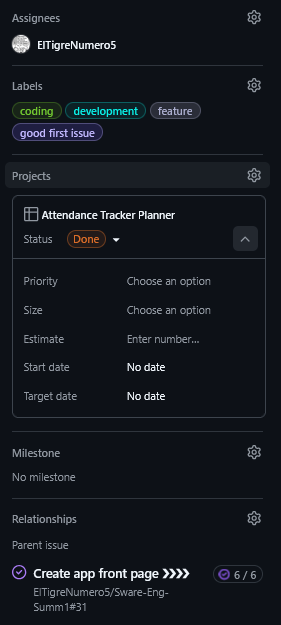

## MVP

The minimum viable product (MVP) demonstrates some of the key functionality and features required by users. The development process was undertaken in two planned sprints and one bonus unplanned one, and broadly page by page. First, I developed the app’s front page. I wrote an HTML structure to define the elements on the page, JavaScript to handle the dynamic data-driven functionality of the application and CSS to set the position and style of all elements. This included title, navigation buttons, and graph of historic attendance percentages based on data and target percentage driven by a user entered value from the inputs page. 

  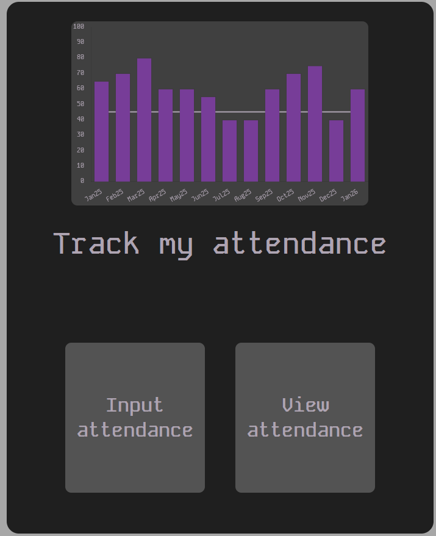

I built the user inputs page, including title, navigation buttons, placeholder for a calendar and specific attendance data entering functionality, display of the user entered attendance target value, and functionality to set that same value. This concluded the planned MVP, simply an app with a chart where the user can change a key value to adjust their attendance target, which would then be displayed on a chart. 

  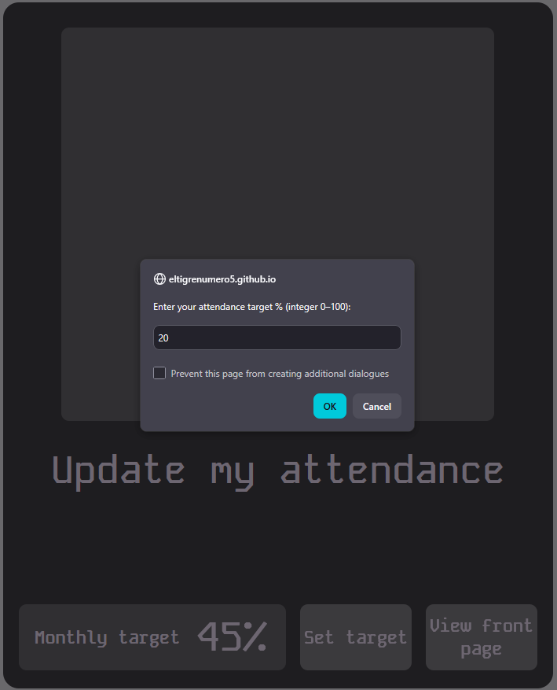
  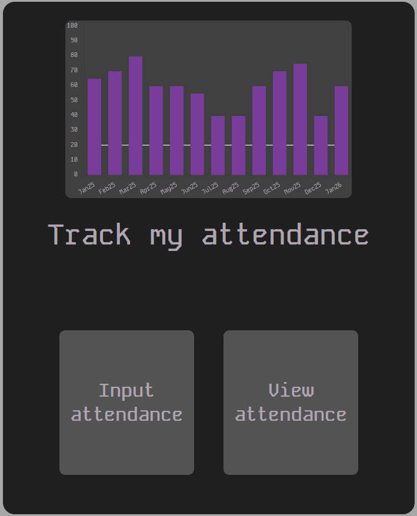

I added a third page of attendance related outputs, including a key user requirement to show the number of days of attendance required, calculated functionally from a hardcoded number of working days in the month, the variable user entered attendance target and a hardcoded number of days attended.

  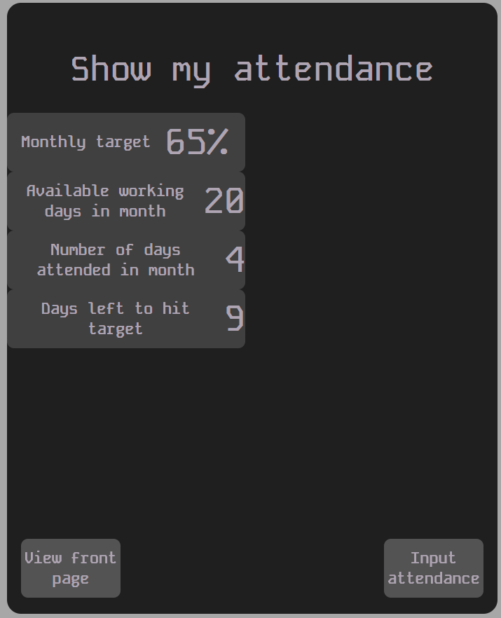

## Test-driven development, continuous integration and continuous deployment

[Test-driven development](https://learning.oreilly.com/library/view/test-driven-development/0321146530/) (TDD) relies on writing a failing unit test, then producing minimal code to pass the test, and repeating the process until the component is successfully built. For this product, TDD was used in the production of several of [the functions](https://github.com/ElTigreNumero5/Sware-Eng-Summ1/blob/4dee39a56ceee7fdbf26ae049c657e0756317278/functions.js). For example, the `attendPC` function is as follows.

  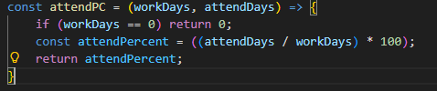

I used [Node]( https://nodejs.org/en) and [Jest](https://jestjs.io/) to build and run [my testing suite](https://github.com/ElTigreNumero5/Sware-Eng-Summ1/blob/4dee39a56ceee7fdbf26ae049c657e0756317278/__tests__/summ1.test.js). Initially there was no function and no code. The first JS test checks that a function called `attendPC` is defined. On first run, that test failed (was red). I wrote just enough code to pass the test (go green) - simply defining an empty function. The next test checks that the function outputs a number between zero and 100. This test passed by adding `return 10` to the function. Later tests increased complexity and specificity, and required earlier tests to be updated, for example when adding parameters to the function, some earlier tests failed and so needed editing. 

  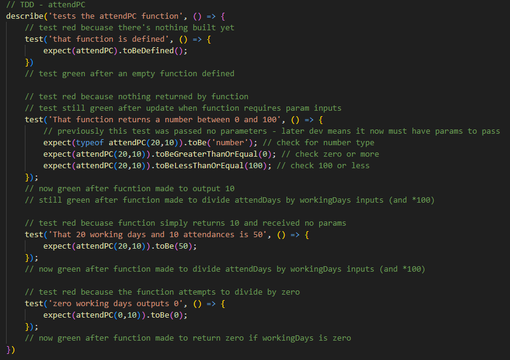

The test suite is minimal and will continue to be updated e.g. to test variable inputs and as the app evolves, but for the MVP where most test values are currently hardcoded, all tests pass and the code can be deemed to be usable.

  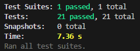

I implemented continuous integration (CI) via GitHub actions. I created a workflow action triggered whenever a commit is made to any branch, or merge to main. This runs the test suite and provides the results with commit details in GitHub. It is therefore possible to understand if code is working correctly as code is written, allowing errors to be fixed as soon as they appear.

  

I implemented continuous deployment (CD) via a GitHub actions workflow. This is triggered by the CI workflow, but only when that CI workflow itself is triggered by a PR merge to main. The CD workflow then only runs after testing runs on a PR merge to main. It is also set up to only carry out its tasks if the CI workflow is successful, i.e. only if all Jest tests pass. Assuming successful tests, the CD workflow builds the app and deploys it to GitHub Pages. In this way, any time a branch is successfully merged to main, the deployed app itself is updated, ensuring it automatically remains current.

  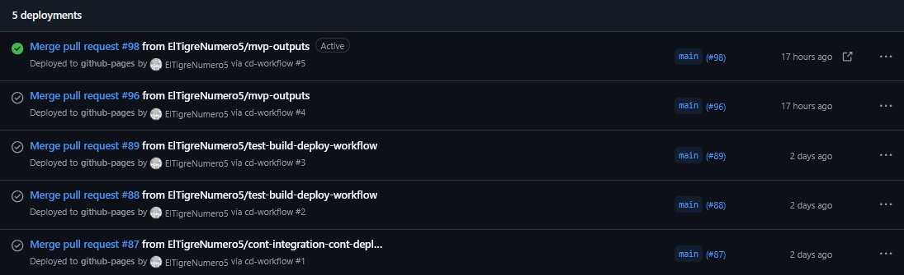

## VS Code and GitHub – adding MVP features gradually

Code and files for this work are contained within a [Git repository]( https://github.com/ElTigreNumero5/Sware-Eng-Summ1). Coding development work was undertaken in locally in Visual Studio (VS) Code. I cloned the remote repo to my local environment to allow synchronisation of files between the local and remote environments. The MVP was developed one issue and one sprint at a time. At the start of each sprint, all issues for that sprint were available in the *Ready* column, and one by one they were moved into *In progress*. 

  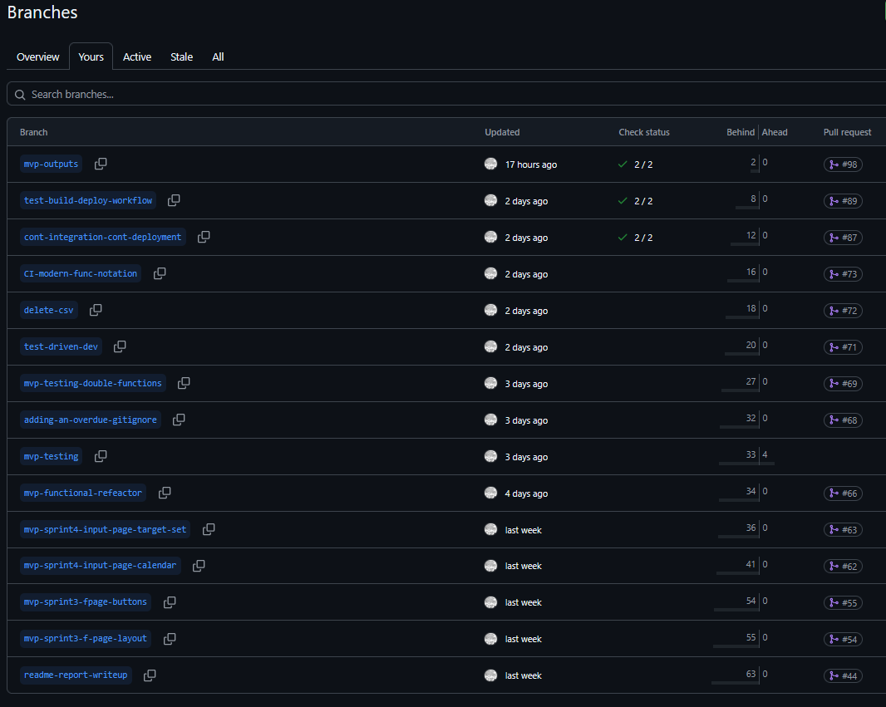

Commits to branches were made regularly, whenever meaningful progress was achieved, to ensure capturing of that progress and that rolling back would be possible. When completed satisfactorily with stated deliverables achieved and the definition of done met, a pull request was created to merge changes to the branch into the main repo. Initially I assigned one of my team as a reviewer of my PRs to ensure code was appropriate and to seek feedback, though as time became tight I later simply merged without review.

  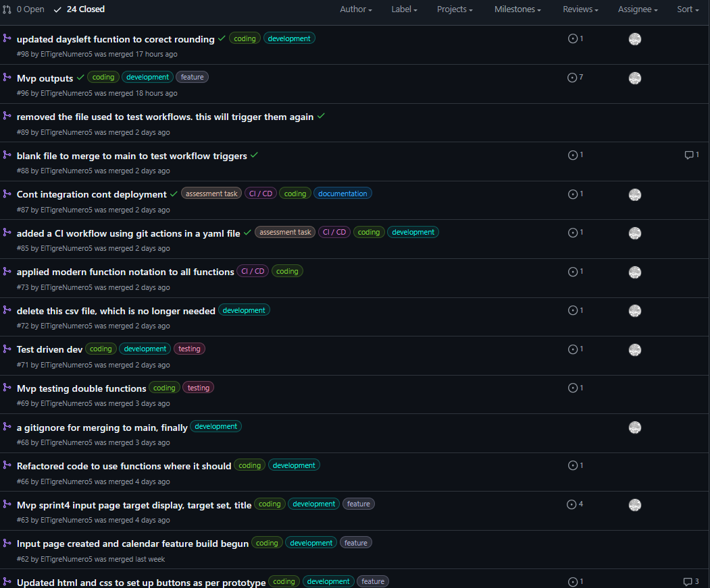

In this way, features were added as they were completed, iteratively, rather than providing a single, finished release once everything was completed, in line with the [Agile principles](https://agilealliance.org/agile101/12-principles-behind-the-agile-manifesto/) of “working software is the primary measure of progress” and “deliver working software frequently”.

## Maintaining the ticketing system, branches and pull requests

As I picked up each ticket I made a decision about whether it required a new branch or should be undertaken within an existing branch. Generally, I created branches for higher level issues, which would contain the work for a few sub-issues. For example, a branch called ‘mvp-sprint4-input-page-target-set’ held all work done to deliver functionality relating to changing the user entered target value, which was ticketed as two sub-issues of [issue #33]( https://github.com/ElTigreNumero5/Sware-Eng-Summ1/issues/33), [issue #59]( https://github.com/ElTigreNumero5/Sware-Eng-Summ1/issues/59) and [issue #60]( https://github.com/ElTigreNumero5/Sware-Eng-Summ1/issues/60). When completed, both issue #59 and issue #60 were closed by [pull request #63]( https://github.com/ElTigreNumero5/Sware-Eng-Summ1/pull/63) and successfully merging the commits made to the ‘mvp-sprint4-input-page-target-set’ branch into main. This means that the issues, the branch and the PR are all linked together, providing a strong documentary record of what work was done to address each issue, in which branch, and what was done to merge that work into the main branch of the app for real use. In the event, I got somewhat ahead of myself with coding this page’s feature set, and delivered four sub-tasks in one branch, merged by a single PR. It may have been better to have separated those out into separate branches, although perhaps one branch to develop one page, covered by the parent ticket was actually the correct level for this small MVP.

## MVP technical and user guides

I created both [technical](https://github.com/ElTigreNumero5/Sware-Eng-Summ1/blob/main/technical-documentation.md) and [user](https://github.com/ElTigreNumero5/Sware-Eng-Summ1/blob/main/user-guide.md) guides as separate markdown documents within the repository. Both are up to date with the latest deployment of the app.

The technical documentation is aimed at developers. It explains what languages were used to build the app and the broad structure and purpose of files written in each language. However, its core purposes are to explain how the code runs the app, how the app can be run locally, and how the test suite can be operated. Each function is explained, including what it is used for, what the input parameters and outputs are. Instructions are provided on how to clone the repo and run the program locally in VS Code, as well as how to run the testing suite using Node and Jest.

The user guidance shows what the app does when it’s run, and how users can operate its functionality. It is much simpler than the technical documentation, with an audience of non-technical users in mind. It provides screenshots of each page and component of the app, and explains what each does, and how it can be used.

## Evaluation

Overall, this is a successful project. There exists a deployed MVP meeting a selection of user needs, and there exists potential to turn the MVP into a useful full product. 

User research was limited. Seeking input from a wider range of users would result in stronger design. It became clear when developing the app that the front page might be redundant. This could have been understood during the design phase. Some design documentation might be improved, with less generalised empathy mapping and more detailed ideation. Improvements could be made to user experience. No link from inputs page to outputs page means users must navigate back to the front page first. 

For testing there exists a fundamental issue in the way the app is constructed. Functions are duplicated, both within the HTML files for the operation of the app, and within the `function.js` file for testing. This introduces a huge risk because unit testing covers only the correct operation of copies of the functions. If changes are made to a function in an HTML file, but not the corresponding `function.js` file, then the testing suite is no longer representative. This should be a priority fix. Testing should also extend to cover interactivity and chart generation functions through mocking.

The use of project management techniques and tools worked well. Using principles of scrum agile to plan sprints and select tickets for delivery in each was positive. GitHub and GitHub projects were incredibly useful tools for recording, tracking, managing, delivering and closing tickets. I feel I’ve gained a powerful skill in an important toolset.

